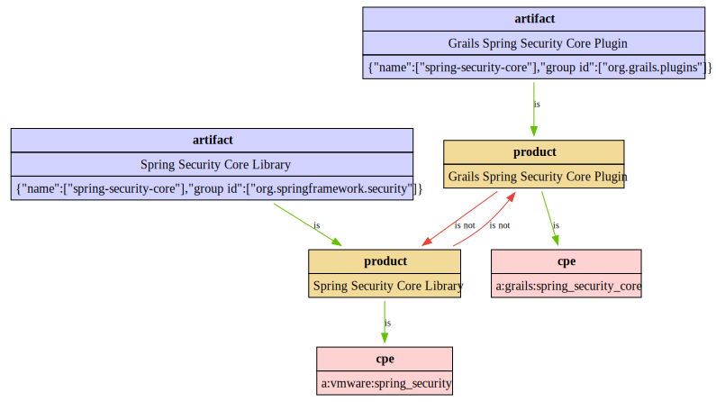

# Bachelorarbeit: Entwicklung einer graphenbasierten Produktmodellierung für das Schwachstellenmanagement

Diese Bachelorarbeit befasst sich mit der Entwicklung eines neuen Systems zur Modellierung von Beziehungen zwischen Softwareprodukten im Kontxt des Schwachstellenmanagements.
Die Arbeit wurde im Rahmen der Anforderungen der [metaeffekt GmbH](https://metaeffekt.com) erstellt und zielt darauf ab, eine bestehende YAML-basierte Lösung für dieses Problem durch ein einheitliches, graphenbasiertes Modell zu ersetzen.

## Problemstellung

Das bisherige System zur Korrelation von Softwareartefakten mit Produktrepräsentationen wie CPE (Common Platform Enumeration) oder PURL (Package URL) wies mehrere Schwächen auf.
Dazu gehörten die Übergeneralisierung von Selektionsregeln, uneinheitliche Typangaben und eine eingeschränkte Nachvollziehbarkeit der getroffenen Entscheidungen.

Die zentrale Forschungsfrage der Arbeit lautet daher:

> Wie muss ein Produkt-zentrisches Datenmodell strukturiert und modelliert werden, um heterogene Repräsentationen von
> Software- und Hardwarekomponenten (wie CPE oder PURL) zuverlässig zu verknüpfen und dabei sowohl manuelle Korrekturen
> als auch die automatische Integration von Daten aus externen Quellen zu ermöglichen?

## Lösungsansatz

Als Lösung wurde ein graphenbasiertes Datenmodell entworfen und in Java implementiert.
In diesem Modell werden Produkte und ihre verschiedenen Repräsentationen als Knoten erfasst, während ihre Beziehungen durch typisierte Kanten beschrieben werden.

Ein Beispiel für einen solchen Graphen ist in der folgenden Abbildung dargestellt:

<figure style="text-align: center;">
  
</figure>

*Visualisierung eines Subgraphen des Korrelationssystems.
Die Abbildung stellt die Informationen als einen Subgraphen aus dem neuen Korrelationssystem dar, dessen Modell Gegenstand dieser Arbeit ist.
Abgebildet ist die Beziehung zwischen zwei identifizierten Softwarekomponenten und ihre semantische Einbettung in das CPE-System.*

Die prototypische Umsetzung des Systems nutzt SQLite zur Speicherung der Daten und separiert im Generierungsschritt klar zwischen automatisch generierten Daten aus öffentlichen Quellen und manuell gepflegten Korrelationen.
Dies erhöht die Transparenz und ermöglicht die gemeinsame Nutzung von öffentlichen Korrelationsdaten.

Ein weiterer Beispielgraph, der die Korrelation von Redis-Komponenten zeigt:

<figure style="text-align: center;">
  
</figure>

*Beispiel eines Subgraphen des Korrelationssystems für Redis.
Dargestellt ist die Beziehungen zwischen der Datenbankkomponente und der Python-Client-Bibliothek.*

## Kernfunktionen

Das neue System bietet eine Reihe von Verbesserungen gegenüber der bisherigen Lösung:

* **Produktzentrisches Graphenmodell:** Die Kerninnovation liegt in dem Einführen eines zentralen Produkt-Knotens, der als logische Klammer für alle heterogenen Repräsentationen (wie CPEs, PURLs, etc.) eines Software-Produkts dient. Er ermöglicht eine konsistente und zentralisierte Verwaltung von Metadaten und Beziehungen.
* **Explizite semantische Beziehungen:** Anstelle einer impliziten, reihenfolgeabhängigen Logik werden nun klare, semantische Kanten wie `is` und `is not` verwendet. Das erhöht die Eindeutigkeit, verhindert Fehlinterpretationen und macht die Modellierungsentscheidungen direkt im Graphen ablesbar.
* **Präzisere Artefakt-Selektion:** Durch eine verbesserte, programmatische Typerkennung können typspezifische Attribute extrahiert werden. Dies erlaubt schärfere, zuverlässigere und granularere Prüfungen bei der Zuordnung von Artefakten.
* **Wiederverwendbarkeit durch Vererbung:** Attribute und Beziehungen können auf einer übergeordneten Ebene (z.B. am Produkt-Knoten) definiert und auf alle untergeordneten Repräsentationsknoten vererbt werden. Dies reduziert Redundanz und verbessert die Wartbarkeit erheblich.
* **Modulares Contributor-System:** Die automatisierte Integration externer Datenquellen ist kein Nachgedanke mehr, sondern ein Kernbestandteil des Systems. Sogenannte "Contributors" verarbeiten externe Daten (z.B. aus [`purl2cpe`](https://github.com/scanoss/purl2cpe)), um den Graphen zu befüllen, bevor manuelle Modifikationen angewendet werden.
* **Verbesserte Nachvollziehbarkeit:** Modellierungsentscheidungen, deren Begründungen und Herkunft können als Metadaten direkt an den Knoten und Kanten gespeichert werden. Diese maschinenlesbare Dokumentation macht die Korrelation nachvollziehbar.

## Fazit

Die Arbeit zeigt, dass ein graphenbasiertes Modell eine effektive Lösung für die Herausforderungen im Schwachstellenmanagement darstellt.
Das entwickelte System bietet eine solide Grundlage für präzisere, transparentere und besser wartbare Korrelationen von Softwareprodukten.
Zukünftige Erweiterungen könnten sich auf die automatische Konvertierung der alten Korrelationsdaten und die Integration weiterer Datenquellen konzentrieren.

Die vorliegende Arbeit hat ein konzeptionell und technisch neues graphenbasiertes Korrelationssystem entwickelt und implementiert.
Es adressiert die Herausforderungen bei der zuverlässigen Zuordnung heterogener Produktrepräsentationen im Schwachstellenmanagement.
Durch die Einführung einer einheitlichen, produktzentrischen Modellierung und expliziter semantischer Beziehungen wurde eine Lösung geschaffen, die die Skalierbarkeit, Wartbarkeit, Konsistenz und Nachvollziehbarkeit gegenüber dem bisherigen System signifikant verbessert.

